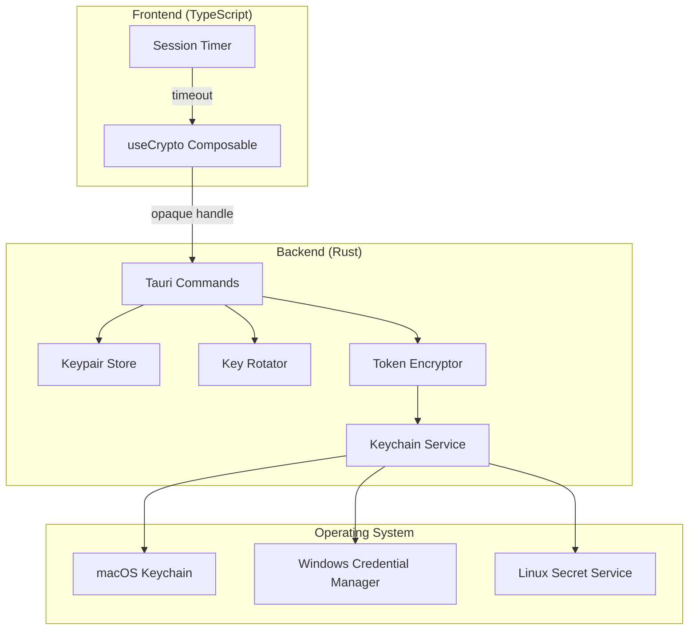

# Design Document: Crypto Security Hardening

## Overview

This design document specifies the security hardening enhancements for the Vortex Image cryptography module. The implementation addresses critical security vulnerabilities including unsafe code patterns, weak token encryption, frontend key exposure, and missing key rotation capabilities.

The design follows a defense-in-depth approach:
1. **Backend-only secrets**: All secret key material stays in Rust, frontend uses opaque handles
2. **OS-level protection**: Leverage platform keychains for token storage
3. **Cryptographic hygiene**: Proper AAD, no Clone on secrets, safe key reconstruction
4. **Key lifecycle management**: Rotation support with backward compatibility

## Architecture



## Components and Interfaces

### 1. Keypair Store (Rust)

Manages in-memory storage of keypairs with opaque handles.

```rust
/// Opaque handle to a keypair - frontend never sees actual bytes
pub type KeypairHandle = u64;

struct KeypairStore {
    keypairs: HashMap<KeypairHandle, Arc<Mutex<HybridKeypair>>>,
    next_handle: KeypairHandle,
    /// Previous keypairs for key rotation (handle -> old keypairs)
    rotated_keypairs: HashMap<KeypairHandle, Vec<Arc<Mutex<HybridKeypair>>>>,
}

impl KeypairStore {
    fn insert(&mut self, keypair: HybridKeypair) -> KeypairHandle;
    fn get(&self, handle: KeypairHandle) -> Option<Arc<Mutex<HybridKeypair>>>;
    fn remove(&mut self, handle: KeypairHandle) -> Option<Arc<Mutex<HybridKeypair>>>;
    fn rotate(&mut self, handle: KeypairHandle) -> Result<(), CryptoError>;
    fn get_all_for_decryption(&self, handle: KeypairHandle) -> Vec<Arc<Mutex<HybridKeypair>>>;
}
```

### 2. Keychain Service (Rust)

Platform-abstracted secure storage using OS keychains.

```rust
pub trait KeychainBackend {
    fn store(&self, key: &str, value: &[u8]) -> Result<(), CryptoError>;
    fn retrieve(&self, key: &str) -> Result<Vec<u8>, CryptoError>;
    fn delete(&self, key: &str) -> Result<(), CryptoError>;
    fn is_available(&self) -> bool;
}

#[cfg(target_os = "macos")]
struct MacOSKeychain;

#[cfg(target_os = "windows")]
struct WindowsCredentialManager;

#[cfg(target_os = "linux")]
struct LinuxSecretService;

struct FallbackKeychain {
    /// Uses salted machine key with additional entropy
    salt: [u8; 32],
}
```

### 3. Token Encryptor (Rust)

Handles token encryption with v4 format and automatic migration.

```rust
/// Token format v4:
/// [version: 1][salt: 32][nonce: 12][aad_len: 2][aad: var][ciphertext: var][tag: 16]
const TOKEN_VERSION_V4: u8 = 0x04;

struct TokenEncryptor {
    keychain: Box<dyn KeychainBackend>,
}

impl TokenEncryptor {
    fn encrypt_token(&self, plaintext: &str, context: &TokenContext) -> Result<Vec<u8>, CryptoError>;
    fn decrypt_token(&self, data: &[u8]) -> Result<(String, Option<Vec<u8>>), CryptoError>;
    fn migrate_v2_token(&self, data: &[u8]) -> Result<Vec<u8>, CryptoError>;
    fn migrate_v3_token(&self, data: &[u8]) -> Result<Vec<u8>, CryptoError>;
}

struct TokenContext {
    service_id: String,
    timestamp: u64,
    additional_data: Option<Vec<u8>>,
}
```

### 4. Safe Dilithium Signing (Rust)

Replaces unsafe transmute with safe byte reconstruction.

```rust
impl HybridKeypair {
    /// Safe Dilithium signing without transmute
    /// Reconstructs keypair from stored bytes using library's from_bytes
    fn sign_dilithium_safe(&self, data: &[u8]) -> Result<Vec<u8>, CryptoError> {
        // Validate byte lengths
        if self.pq_signing_key.len() != DIL_SECRETKEYBYTES {
            return Err(CryptoError::InvalidInput("invalid signing key length".into()));
        }
        if self.pq_verifying_key.len() != DIL_PUBLICKEYBYTES {
            return Err(CryptoError::InvalidInput("invalid verifying key length".into()));
        }
        
        // Reconstruct keypair from bytes (safe, no transmute)
        let mut combined = Vec::with_capacity(DIL_PUBLICKEYBYTES + DIL_SECRETKEYBYTES);
        combined.extend_from_slice(&self.pq_verifying_key);
        combined.extend_from_slice(self.pq_signing_key.as_slice());
        
        // Use library's safe reconstruction
        let keypair = DilithiumKeypair::from_bytes(&combined)
            .map_err(|_| CryptoError::KeyGeneration("keypair reconstruction failed".into()))?;
        
        Ok(keypair.sign(data).to_vec())
    }
}
```

### 5. Frontend Crypto Composable (TypeScript)

Updated interface using opaque handles with session timeout.

```typescript
export interface KeypairInfo {
  handle: number;           // Opaque handle, NOT bytes
  public_bundle: PublicBundle;
  created_at: number;
  key_id: string;
}

export interface CryptoState {
  keypairHandle: Ref<number | null>;
  publicBundle: Ref<PublicBundle | null>;
  isUnlocked: Ref<boolean>;
  lastActivity: Ref<number>;
}

export function useCrypto() {
  const state: CryptoState;
  const SESSION_TIMEOUT_MS = 15 * 60 * 1000; // 15 minutes
  
  // Session timeout management
  function resetActivityTimer(): void;
  function checkSessionTimeout(): void;
  
  // Keypair operations (using handles)
  async function generateKeypair(): Promise<KeypairInfo>;
  async function signData(data: Uint8Array): Promise<Uint8Array>;
  async function decryptData(encrypted: Uint8Array): Promise<Uint8Array>;
  
  // Key rotation
  async function rotateKeypair(): Promise<KeypairInfo>;
}
```

## Data Models

### SecretBytes (No Clone)

```rust
/// Wrapper for secret key material that zeroizes on drop
/// NOTE: Clone intentionally NOT derived to prevent accidental copies
#[derive(Zeroize, ZeroizeOnDrop)]
pub struct SecretBytes(Vec<u8>);

impl SecretBytes {
    pub fn new(data: Vec<u8>) -> Self;
    pub fn as_slice(&self) -> &[u8];
    pub fn len(&self) -> usize;
    
    /// Explicit clone for when absolutely necessary (auditable)
    /// This method name makes cloning visible in code review
    pub fn clone_secret(&self) -> Self {
        Self(self.0.clone())
    }
}
```

### Token Format v4

```
+--------+--------+--------+--------+--------+--------+
| Ver(1) | Salt(32)        | Nonce(12)       | AAD    |
+--------+--------+--------+--------+--------+--------+
| AAD_Len(2) | AAD(var)    | Ciphertext(var) | Tag(16)|
+--------+--------+--------+--------+--------+--------+

Version: 0x04
Salt: Random 32 bytes for key derivation
Nonce: Random 12 bytes for ChaCha20-Poly1305
AAD_Len: 2-byte little-endian length of AAD
AAD: Associated Authenticated Data (service_id + timestamp)
Ciphertext: Encrypted plaintext
Tag: Poly1305 authentication tag
```

### EncryptedPayload with AAD

```rust
#[derive(Clone, Debug, Serialize, Deserialize)]
pub struct EncryptedPayload {
    pub nonce: [u8; 12],
    pub ciphertext: Vec<u8>,
    pub encap: EncapsulatedKey,
    /// BLAKE3 hash of AAD for verification
    pub aad_hash: Option<[u8; 32]>,
}
```

## Correctness Properties

*A property is a characteristic or behavior that should hold true across all valid executions of a system—essentially, a formal statement about what the system should do. Properties serve as the bridge between human-readable specifications and machine-verifiable correctness guarantees.*

### Property 1: Safe Signing Round-Trip

*For any* valid HybridKeypair and any data bytes, signing with `sign_dilithium_safe` and then verifying with the corresponding public key SHALL succeed.

**Validates: Requirements 2.2**

### Property 2: Keypair Byte Validation

*For any* byte array with length not equal to the expected keypair size, reconstruction SHALL fail with an InvalidInput error.

**Validates: Requirements 2.4**

### Property 3: Opaque Handle Generation

*For any* generated keypair, the returned handle SHALL be a positive integer, and the same keypair SHALL NOT be accessible via any other handle.

**Validates: Requirements 4.1**

### Property 4: Handle Lookup Correctness

*For any* valid handle in the KeypairStore, lookup SHALL return the associated keypair. *For any* handle not in the store, lookup SHALL return None.

**Validates: Requirements 4.4**

### Property 5: Handle Release Cleanup

*For any* handle that has been released from the KeypairStore, subsequent lookup attempts SHALL return None.

**Validates: Requirements 4.5**

### Property 6: Key Rotation Decryption Compatibility

*For any* handle with N rotations, data encrypted with any of the N+1 keypairs (current + N rotated) SHALL decrypt successfully using that handle.

**Validates: Requirements 5.1, 5.2, 5.3**

### Property 7: Rotation Metadata Accuracy

*For any* keypair after K rotations, the rotation_count metadata SHALL equal K, and created_at SHALL be a valid Unix timestamp.

**Validates: Requirements 5.5**

### Property 8: Re-encryption Validity

*For any* data re-encrypted after key rotation, the result SHALL be decryptable with the new (current) key only.

**Validates: Requirements 5.6**

### Property 9: Token Version Byte

*For any* newly encrypted token, the first byte SHALL be 0x04.

**Validates: Requirements 6.1**

### Property 10: Token Salt Uniqueness

*For any* two tokens encrypted from the same plaintext, the salt bytes (bytes 1-32) SHALL differ.

**Validates: Requirements 6.2**

### Property 11: AAD Binding Correctness

*For any* encryption with AAD, decryption with matching AAD SHALL succeed, and decryption with any different AAD SHALL fail with a decryption error.

**Validates: Requirements 6.3, 7.2, 7.3, 7.4**

### Property 12: Legacy Token Migration

*For any* valid v2 or v3 token, decryption SHALL succeed and the returned upgraded token SHALL have version byte 0x04.

**Validates: Requirements 6.4, 6.5**

### Property 13: Invalid Version Rejection

*For any* token with version byte not in {0x02, 0x03, 0x04}, decryption SHALL fail with an InvalidInput error.

**Validates: Requirements 6.6**

### Property 14: Session Timeout Behavior

*For any* session where no crypto operation occurs for longer than the timeout duration, the keypair handle SHALL be cleared and isUnlocked SHALL be false.

**Validates: Requirements 9.1, 9.2, 9.3, 9.5**

### Property 15: Handle Validation Correctness

*For any* keypair handle, `validate_keypair_handle` SHALL return true if and only if the handle exists in the KeypairStore.

**Validates: Requirements 11.1, 11.2, 11.3**

### Property 16: Compression Result Transparency

*For any* compression operation, the result SHALL accurately indicate whether compression was actually applied via the `was_compressed` field.

**Validates: Requirements 12.1, 12.2**

### Property 17: Strict Algorithm Validation

*For any* invalid algorithm name passed to strict compression functions, the function SHALL return an error rather than silently defaulting.

**Validates: Requirements 12.3, 12.4**

## Error Handling

### Error Types

```rust
#[derive(Error, Debug)]
pub enum CryptoError {
    #[error("encryption failed")]
    Encrypt(String),
    
    #[error("decryption failed")]
    Decrypt(String),
    
    #[error("key exchange failed")]
    KeyExchange(String),
    
    #[error("signature verification failed")]
    SignatureInvalid,
    
    #[error("key derivation failed")]
    KeyDerivation(String),
    
    #[error("key generation failed")]
    KeyGeneration(String),
    
    #[error("invalid input data")]
    InvalidInput(String),
    
    #[error("not supported on this platform")]
    NotSupported,
    
    #[error("keypair not found")]
    KeypairNotFound,
    
    #[error("keychain error")]
    Keychain(String),
    
    #[error("key rotation required")]
    KeyRotationRequired,
    
    #[error("AAD mismatch")]
    AadMismatch,
    
    #[error("unsupported token version")]
    UnsupportedTokenVersion(u8),
}
```

### Error Handling Strategy

1. **Generic messages to frontend**: Serialize errors with generic messages to prevent information leakage
2. **Detailed logging**: Log detailed errors server-side for debugging
3. **Graceful degradation**: Fall back to machine-key encryption if keychain unavailable
4. **Automatic migration**: Silently upgrade legacy tokens on decryption

## Testing Strategy

### Unit Tests

Unit tests verify specific examples and edge cases:

- Keychain backend availability detection
- Token format parsing edge cases
- Handle generation uniqueness
- Session timeout configuration

### Property-Based Tests

Property-based tests verify universal properties using the `proptest` crate with minimum 100 iterations per test.

Each property test must be tagged with:
```rust
// Feature: crypto-security-hardening, Property N: [property description]
// Validates: Requirements X.Y
```

### Test Configuration

```toml
[dev-dependencies]
proptest = "1.4"

[profile.test]
opt-level = 1  # Faster PBT iterations
```

### Integration Tests

Platform-specific integration tests for keychain backends:
- macOS: Test Keychain Services API
- Windows: Test Credential Manager API
- Linux: Test Secret Service D-Bus API

### Test Coverage Requirements

- All 14 correctness properties must have corresponding property tests
- Edge cases for token version handling (v2, v3, v4, invalid)
- Keychain fallback scenarios
- Session timeout boundary conditions
