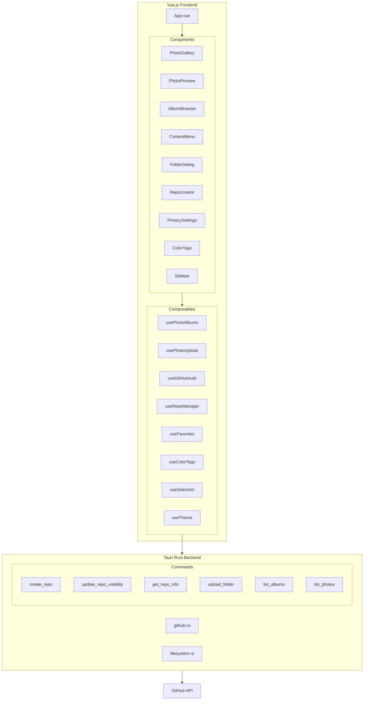

# Design Document: Photo Manager Enhancement

## Overview

This design transforms the iMAGE Tauri + Vue.js photo management application into a production-ready system with advanced album management, GitHub integration, responsive UI, favorites, color tagging, and a modern dark theme. The architecture follows a clean separation between the Rust backend (Tauri commands) and Vue.js frontend (composables and components).

## Architecture



## Components and Interfaces

### Frontend Components

#### 1. FolderUploadDialog.vue
Displays when user uploads a folder, offering album creation options.

```typescript
interface FolderUploadDialogProps {
  folderPath: string
  folderName: string
  subfolderCount: number
  imageCount: number
}

interface FolderUploadDialogEmits {
  (e: 'confirm', mode: 'album' | 'recursive'): void
  (e: 'cancel'): void
}
```

#### 2. RepoCreator.vue
Modal for creating new GitHub repositories.

```typescript
interface RepoConfig {
  name: string
  description: string
  visibility: 'public' | 'private'
  autoInit: boolean
}

interface RepoCreatorEmits {
  (e: 'created', repo: string): void
  (e: 'close'): void
}
```

#### 3. PhotoPreview.vue
Individual photo thumbnail with resize handle and favorite button.

```typescript
interface PhotoPreviewProps {
  photo: Photo
  size: number
  selected: boolean
  favorited: boolean
  colorTag?: string
}

interface PhotoPreviewEmits {
  (e: 'select', photo: Photo, additive: boolean): void
  (e: 'resize', newSize: number): void
  (e: 'favorite', photo: Photo): void
  (e: 'contextmenu', event: MouseEvent, photo: Photo): void
}
```

#### 4. ContextMenu.vue
Right-click context menu for batch operations.

```typescript
interface ContextMenuProps {
  x: number
  y: number
  items: ContextMenuItem[]
}

interface ContextMenuItem {
  id: string
  label: string
  icon?: string
  submenu?: ContextMenuItem[]
  action?: () => void
}
```

#### 5. AlbumTree.vue
Sidebar component showing album hierarchy.

```typescript
interface Album {
  name: string
  path: string
  photoCount: number
  children: Album[]
}

interface AlbumTreeProps {
  albums: Album[]
  selectedPath: string | null
}
```

#### 6. ColorTagPanel.vue
Sidebar section showing color tags with counts.

```typescript
interface ColorTag {
  id: string
  color: string
  name: string
  count: number
}
```

#### 7. UploadToast.vue
Persistent toast notification for file transfer progress.

```typescript
interface FileTransfer {
  id: string
  fileName: string
  progress: number  // 0-100
  status: 'pending' | 'uploading' | 'downloading' | 'completed' | 'failed'
  error?: string
}

interface UploadToastProps {
  transfers: FileTransfer[]
  visible: boolean
}

interface UploadToastEmits {
  (e: 'retry', transferId: string): void
  (e: 'cancel', transferId: string): void
  (e: 'dismiss'): void
}
```

#### 8. SyncStatusIndicator.vue
Photo sync status indicator with action menu.

```typescript
type SyncStatus = 'local-only' | 'remote-only' | 'synced'

interface SyncStatusIndicatorProps {
  status: SyncStatus
  photoId: string
}

interface SyncStatusIndicatorEmits {
  (e: 'upload', photoId: string): void
  (e: 'download', photoId: string): void
  (e: 'remove-local', photoId: string): void
  (e: 'delete-remote', photoId: string): void
}
```

### Backend Commands (Rust)

#### New Tauri Commands

```rust
// Repository management
#[tauri::command]
async fn create_repo(
    client: State<'_, HttpClient>,
    token: String,
    name: String,
    description: String,
    private: bool,
) -> Result<RepoInfo, AppError>

#[tauri::command]
async fn update_repo_visibility(
    client: State<'_, HttpClient>,
    token: String,
    repo: String,
    private: bool,
) -> Result<(), AppError>

#[tauri::command]
async fn get_repo_info(
    client: State<'_, HttpClient>,
    token: String,
    repo: String,
) -> Result<RepoInfo, AppError>

// Folder/Album management
#[tauri::command]
async fn scan_folder(
    path: String,
) -> Result<FolderScanResult, AppError>

#[tauri::command]
async fn upload_folder_as_album(
    app: AppHandle,
    client: State<'_, HttpClient>,
    path: String,
    repo: String,
    token: String,
    album_name: String,
    create_subalbums: bool,
) -> Result<UploadBatchResult, AppError>

#[tauri::command]
async fn list_albums(
    client: State<'_, HttpClient>,
    repo: String,
    token: String,
) -> Result<Vec<Album>, AppError>
```

### Composables

#### useRepoManager.ts
```typescript
interface RepoInfo {
  name: string
  fullName: string
  private: boolean
  description: string
  htmlUrl: string
}

export function useRepoManager() {
  const creating = ref(false)
  const error = ref<string | null>(null)
  
  async function createRepo(config: RepoConfig): Promise<RepoInfo>
  async function getRepoInfo(repo: string): Promise<RepoInfo>
  async function updateVisibility(repo: string, isPrivate: boolean): Promise<void>
  
  return { creating, error, createRepo, getRepoInfo, updateVisibility }
}
```

#### useFavorites.ts
```typescript
interface FavoriteItem {
  type: 'photo' | 'album'
  id: string
  path: string
  addedAt: number
}

export function useFavorites() {
  const favorites = ref<FavoriteItem[]>([])
  
  function isFavorite(id: string): boolean
  function toggleFavorite(item: Photo | Album): void
  function getFavorites(): FavoriteItem[]
  async function loadFavorites(): Promise<void>
  async function saveFavorites(): Promise<void>
  
  return { favorites, isFavorite, toggleFavorite, getFavorites, loadFavorites, saveFavorites }
}
```

#### useColorTags.ts
```typescript
interface ColorTagDefinition {
  id: string
  color: string
  name: string
}

interface TaggedItem {
  itemId: string
  tagId: string
}

export function useColorTags() {
  const tags = ref<ColorTagDefinition[]>([])
  const taggedItems = ref<TaggedItem[]>([])
  
  function getItemTags(itemId: string): ColorTagDefinition[]
  function tagItems(itemIds: string[], tagId: string): void
  function removeTag(itemId: string, tagId: string): void
  function renameTag(tagId: string, newName: string): void
  function getItemsByTag(tagId: string): string[]
  
  return { tags, taggedItems, getItemTags, tagItems, removeTag, renameTag, getItemsByTag }
}
```

#### useSelection.ts
```typescript
export function useSelection() {
  const selected = ref<Set<string>>(new Set())
  const lastSelected = ref<string | null>(null)
  
  function select(id: string, additive: boolean, range: boolean, allIds: string[]): void
  function clearSelection(): void
  function isSelected(id: string): boolean
  function getSelected(): string[]
  
  return { selected, select, clearSelection, isSelected, getSelected }
}
```

#### usePhotoPreviewSize.ts
```typescript
export function usePhotoPreviewSize() {
  const size = ref(180)
  const MIN_SIZE = 80
  const MAX_SIZE = 400
  
  function setSize(newSize: number): void
  async function loadSize(): Promise<void>
  async function saveSize(): Promise<void>
  
  return { size, MIN_SIZE, MAX_SIZE, setSize, loadSize, saveSize }
}
```

#### useUploadToast.ts
```typescript
interface FileTransfer {
  id: string
  fileName: string
  progress: number
  status: 'pending' | 'uploading' | 'downloading' | 'completed' | 'failed'
  error?: string
  type: 'upload' | 'download'
}

export function useUploadToast() {
  const transfers = ref<FileTransfer[]>([])
  const isExpanded = ref(false)
  const isVisible = computed(() => transfers.value.length > 0)
  
  function addTransfer(id: string, fileName: string, type: 'upload' | 'download'): void
  function updateProgress(id: string, progress: number): void
  function setStatus(id: string, status: FileTransfer['status'], error?: string): void
  function removeTransfer(id: string): void
  function clearCompleted(): void
  function getActiveCount(): number
  function getSummaryText(): string
  
  return { transfers, isExpanded, isVisible, addTransfer, updateProgress, setStatus, removeTransfer, clearCompleted, getActiveCount, getSummaryText }
}
```

#### useSyncStatus.ts
```typescript
type SyncStatus = 'local-only' | 'remote-only' | 'synced'

interface PhotoSyncState {
  photoId: string
  status: SyncStatus
  localPath?: string
  remotePath?: string
}

export function useSyncStatus() {
  const syncStates = ref<Map<string, PhotoSyncState>>(new Map())
  
  function getStatus(photoId: string): SyncStatus
  function setStatus(photoId: string, status: SyncStatus): void
  async function uploadPhoto(photoId: string): Promise<void>
  async function downloadPhoto(photoId: string): Promise<void>
  async function removeLocalCopy(photoId: string): Promise<void>
  async function deleteFromRemote(photoId: string): Promise<void>
  function getStatusTooltip(status: SyncStatus): string
  function getAvailableActions(status: SyncStatus): string[]
  
  return { syncStates, getStatus, setStatus, uploadPhoto, downloadPhoto, removeLocalCopy, deleteFromRemote, getStatusTooltip, getAvailableActions }
}
```

## Data Models

### Photo
```typescript
interface Photo {
  sha: string           // Unique identifier (Git SHA)
  name: string          // File name
  path: string          // Full path in repo (e.g., "photos/album1/image.jpg")
  url: string           // Download URL
  album: string | null  // Parent album path or null for root
  size?: number         // File size in bytes
  uploadedAt?: number   // Upload timestamp
}
```

### Album
```typescript
interface Album {
  name: string          // Display name
  path: string          // Full path in repo
  photoCount: number    // Number of photos directly in album
  totalCount: number    // Including nested albums
  children: Album[]     // Sub-albums
}
```

### RepoInfo
```typescript
interface RepoInfo {
  name: string
  fullName: string      // "owner/repo"
  private: boolean
  description: string
  htmlUrl: string
  defaultBranch: string
}
```

### FolderScanResult
```typescript
interface FolderScanResult {
  path: string
  name: string
  imageCount: number
  totalSize: number
  subfolders: FolderScanResult[]
}
```

### AppSettings (persisted)
```typescript
interface AppSettings {
  token: string | null
  repo: string
  previewSize: number
  viewMode: 'grid' | 'list'
  theme: ThemeConfig
  favorites: FavoriteItem[]
  colorTags: ColorTagDefinition[]
  taggedItems: TaggedItem[]
}
```


## Correctness Properties

*A property is a characteristic or behavior that should hold true across all valid executions of a system—essentially, a formal statement about what the system should do. Properties serve as the bridge between human-readable specifications and machine-verifiable correctness guarantees.*

### Property 1: Album Structure Preservation
*For any* folder structure with subfolders, when uploaded in "Create Album" mode, the resulting GitHub repository folder structure SHALL be isomorphic to the original folder structure (same nesting depth and folder names).
**Validates: Requirements 1.2, 1.4**

### Property 2: Recursive Image Extraction Completeness
*For any* folder structure containing N total images across all nested subfolders, when uploaded in "Import Recursively" mode, exactly N images SHALL be uploaded to the root photos folder.
**Validates: Requirements 1.3**

### Property 3: Partial Upload Result Partitioning
*For any* batch upload where some files succeed and some fail, the result object SHALL contain exactly two disjoint sets: succeeded files and failed files, where their union equals the original file set.
**Validates: Requirements 1.5**

### Property 4: Repository Name Validation
*For any* string input as repository name, the validation function SHALL accept only strings matching the pattern `^[a-zA-Z0-9._-]+$` with length between 1 and 100 characters, and reject all others.
**Validates: Requirements 2.6**

### Property 5: Repository Creation State Update
*For any* successful repository creation, the application's configured repository setting SHALL equal the newly created repository's full name (owner/repo format).
**Validates: Requirements 2.4**

### Property 6: Privacy Sync Bidirectional Consistency
*For any* privacy setting change (local or remote), after sync completes, the local privacy setting SHALL match the GitHub repository's actual visibility state.
**Validates: Requirements 3.1, 3.2**

### Property 7: Preview Size Bounds Enforcement
*For any* attempted preview size value (including values from drag operations), the resulting size SHALL be clamped to the range [80, 400] pixels.
**Validates: Requirements 4.4**

### Property 8: Preview Size Persistence Round-Trip
*For any* valid preview size set by the user, saving and then loading settings SHALL restore the exact same size value.
**Validates: Requirements 4.3**

### Property 9: Batch Resize Uniformity
*For any* set of selected photos and any resize operation, all selected photos SHALL have identical size values after the operation completes.
**Validates: Requirements 4.5**

### Property 10: Favorite Toggle Idempotence
*For any* item, toggling favorite status twice SHALL return the item to its original favorite state.
**Validates: Requirements 5.2**

### Property 11: Favorites Persistence Round-Trip
*For any* set of favorited items, saving and then loading favorites SHALL restore the exact same set of favorited item IDs.
**Validates: Requirements 5.3**

### Property 12: Favorites View Completeness
*For any* set of favorited items, the Favorites view SHALL display exactly those items and no others.
**Validates: Requirements 5.4**

### Property 13: Favorites Type Support
*For any* item of type 'photo' or 'album', the favorites system SHALL accept it for favoriting without error.
**Validates: Requirements 5.5**

### Property 14: Favorites Grouping Correctness
*For any* mixed set of favorited photos and albums, the grouped view SHALL partition items such that all photos are in one group and all albums in another, with no items missing or duplicated.
**Validates: Requirements 5.6**

### Property 15: Color Tag Batch Application
*For any* set of selected items and any color tag, after applying the tag, all selected items SHALL have that tag in their tag list.
**Validates: Requirements 6.3**

### Property 16: Color Tag Auto-Registration
*For any* color tag applied to items, that tag SHALL appear in the sidebar tag list with a count equal to the number of items tagged with it.
**Validates: Requirements 6.4**

### Property 17: Color Tag Persistence Round-Trip
*For any* set of color tags with custom names and tagged items, saving and loading SHALL restore the exact same tags, names, and item associations.
**Validates: Requirements 6.6**

### Property 18: Color Tag Filter Correctness
*For any* color tag, filtering by that tag SHALL display exactly the items that have that tag applied, and no others.
**Validates: Requirements 6.7**

### Property 19: Additive Selection Accumulation
*For any* existing selection and any new item clicked with Ctrl/Cmd held, the new selection SHALL be the union of the previous selection and the new item.
**Validates: Requirements 7.1**

### Property 20: Range Selection Completeness
*For any* anchor item and target item in an ordered list, shift-clicking the target SHALL select all items between anchor and target (inclusive), regardless of click order.
**Validates: Requirements 7.2**

### Property 21: Album Tree Expand Control Presence
*For any* album with non-empty children array, the album tree item SHALL render with expand/collapse controls.
**Validates: Requirements 8.2**

### Property 22: Album Filter Correctness
*For any* album, clicking it SHALL result in the photo view displaying exactly the photos whose path starts with that album's path.
**Validates: Requirements 8.3**

### Property 23: Album Photo Count Accuracy
*For any* album displayed in the sidebar, the shown photo count SHALL equal the actual number of photos in that album (not including sub-albums).
**Validates: Requirements 8.4**

### Property 24: Theme Persistence Round-Trip
*For any* theme configuration (accent color, effects enabled), saving and loading SHALL restore the exact same configuration.
**Validates: Requirements 9.5**

### Property 25: Theme Accessibility Contrast
*For any* theme configuration, all text-background color pairs SHALL meet WCAG AA contrast ratio requirements (4.5:1 for normal text, 3:1 for large text).
**Validates: Requirements 9.6**

### Property 26: View Mode Persistence Round-Trip
*For any* view mode ('grid' or 'list'), saving and loading SHALL restore the same view mode.
**Validates: Requirements 10.4**

### Property 27: Upload Progress Individual Tracking
*For any* batch upload of N files, there SHALL be exactly N progress entries, each with a unique file identifier and independent progress value.
**Validates: Requirements 11.1**

### Property 28: Upload Progress Calculation Correctness
*For any* batch upload with individual file progress values, the overall percentage SHALL equal (sum of individual percentages) / (number of files), and speed SHALL equal (bytes transferred) / (elapsed time).
**Validates: Requirements 11.2, 11.3**

### Property 29: Toast Visibility During Active Transfers
*For any* set of file transfers where at least one transfer has status 'uploading' or 'downloading', the toast SHALL be visible.
**Validates: Requirements 13.1, 13.2**

### Property 30: Toast Summary Count Accuracy
*For any* set of active file transfers, the summary text SHALL display the exact count of transfers with status 'uploading' or 'downloading'.
**Validates: Requirements 13.3**

### Property 31: Toast Auto-Dismiss on Completion
*For any* set of file transfers where all transfers have status 'completed', the toast SHALL auto-dismiss after the configured delay.
**Validates: Requirements 13.6**

### Property 32: Toast Persistence on Failure
*For any* set of file transfers where at least one transfer has status 'failed', the toast SHALL remain visible regardless of other transfer states.
**Validates: Requirements 13.7**

### Property 33: Sync Status State Completeness
*For any* photo, the sync status SHALL be exactly one of: 'local-only', 'remote-only', or 'synced'.
**Validates: Requirements 14.2**

### Property 34: Sync Status Tooltip Accuracy
*For any* sync status value, the tooltip text SHALL accurately describe that specific state.
**Validates: Requirements 14.3**

### Property 35: Sync Action Menu Relevance
*For any* sync status, the available actions SHALL only include operations that are valid for that state (e.g., 'local-only' cannot show 'Download from GitHub').
**Validates: Requirements 14.6**

### Property 36: Sync Action State Transition
*For any* sync action executed successfully, the resulting sync status SHALL reflect the expected state change (e.g., upload changes 'local-only' to 'synced').
**Validates: Requirements 14.7**

## Error Handling

### Frontend Error Handling

1. **Network Errors**: All API calls wrapped in try-catch with user-friendly error messages displayed via toast notifications
2. **Validation Errors**: Form inputs validated before submission with inline error messages
3. **Upload Failures**: Individual file failures don't stop batch; failed files shown with retry option
4. **Auth Errors**: Token expiration triggers re-authentication flow automatically

### Backend Error Handling

```rust
#[derive(Error, Debug)]
pub enum AppError {
    #[error("Network error: {0}")]
    Network(#[from] reqwest::Error),
    #[error("IO error: {0}")]
    Io(#[from] std::io::Error),
    #[error("Validation error: {0}")]
    Validation(String),
    #[error("API error: {0}")]
    Api(String),
    #[error("Auth error: {0}")]
    Auth(String),
    #[error("Rate limit exceeded, retry after {0} seconds")]
    RateLimit(u32),
}
```

### Error Recovery Strategies

| Error Type | Recovery Strategy |
|------------|-------------------|
| Network timeout | Automatic retry with exponential backoff (max 3 attempts) |
| Rate limit | Wait for specified duration, then retry |
| Auth failure | Clear token, prompt re-login |
| Partial upload failure | Continue with remaining files, report failures at end |
| Invalid input | Show validation error, don't submit |

## Testing Strategy

### Unit Tests
- Test individual composable functions in isolation
- Test Rust command logic with mocked HTTP client
- Test validation functions with edge cases
- Test data transformation functions

### Property-Based Tests
Property-based testing will be implemented using **fast-check** for TypeScript/Vue components and **proptest** for Rust backend.

Each correctness property from the design document will be implemented as a property-based test with minimum 100 iterations.

**Test Configuration:**
```typescript
// fast-check configuration
fc.configureGlobal({ numRuns: 100 })
```

```rust
// proptest configuration
proptest! {
    #![proptest_config(ProptestConfig::with_cases(100))]
    // ... tests
}
```

**Test Annotation Format:**
```typescript
// Feature: photo-manager-enhancement, Property 7: Preview Size Bounds Enforcement
test.prop([fc.integer()], (attemptedSize) => {
  const result = clampSize(attemptedSize)
  return result >= 80 && result <= 400
})
```

### Integration Tests
- Test full upload flow with mock GitHub API
- Test privacy sync with mock repository state
- Test album creation with folder scanning

### E2E Tests (Playwright)
- Test critical user flows: login, upload, favorite, tag
- Test responsive layout at different viewport sizes
- Test keyboard navigation and accessibility
